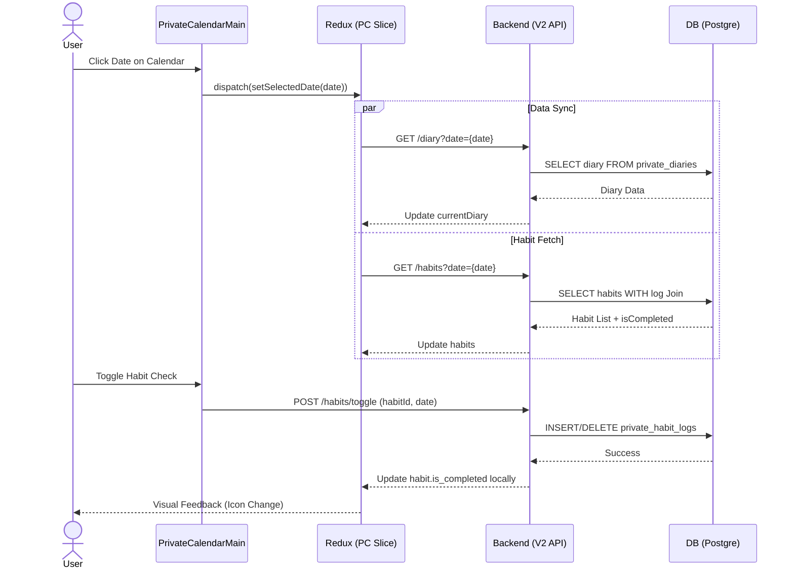

# 🏗️ System Architecture & Data Flow

**[Version: v3.0_20260219]**

이 문서는 `aicc8_deploy_app`의 전체 시스템 구조와 데이터 흐름, 특히 **Private Calendar (v2)** 시스템의 복합적인 상호작용을 상세히 기술합니다.

---

## 1. System Architecture Diagram (Full-Stack)

```mermaid
graph TD
    User[User (Browser)] -->|Interaction| UI[React UI Components]
    UI -->|Dispatch Action| Redux[Redux Store]

    subgraph "Frontend Layer (V2 Private)"
    Redux -->|Selection| PC_Main[PrivateCalendarMain]
    PC_Main -->|Tab Switching| Tabs[Diary/Habit/Todo/Schedule]
    Tabs -->|Async Thunk| API_V2[Private API Service]
    end

    API_V2 -->|HTTP Request| Server[Express Server]

    subgraph "Backend Layer (Mixed Architecture)"
    Server -->|Router| R2[PrivateCalendarRoutes_v2]
    R2 -->|Controller| C2[PrivateCalendarControllers_v2]
    C2 -->|SQL| DB2[(PostgreSQL - Private Tables)]
    end

    DB2 -->|JSON Results| C2
    C2 -->|Response| API_V2
    API_V2 -->|Update State| Redux
```

---

## 2. Data Flow Analysis (Private Calendar Focus)

### 2.1 Critical Data Journey Table

| 변수명 (Variable) | 발생/생성 위치 | 변화/가공 로직 | 참조/최종 목적지 |
|:---|:---|:---|:---|
| **userId** | `GoogleLogin` | Redux `authSlice` 저장 | 모든 API 호출의 필수 Param |
| **selectedDate** | `CalendarTab` (Click) | `setSelectedDate` (Redux) | `fetchDiaryThunk`, `getHabit` 필터링 기준 |
| **currentDiary** | `DiaryTab` | `fetchDiaryThunk` -> Redux 저장 | 다이어리 편집기 및 프리뷰 렌더링 |
| **habits** | `HabitTab` | `toggleHabitCheckThunk` (Completed 변환) | 오늘 습관 리스트 및 달성률 통계 |
| **attachments** | `ScheduleTab` | `FileReader` (Base64) -> 업로드 | 일정 상세 모달 및 목록 내 썸네일 |

---

## 3. Sequence Diagram (Day-to-Day Life Logging)



---

## 4. Directory & File Relationship (V2)

- **`front/src/components/v2/PrivateCalendar/`**
  - `PrivateCalendarMain.jsx`: 전체 레이아웃 및 탭 스위칭 (Hub 역할).
  - `CalendarTab.jsx`: 통합된 날짜 선택 브라우저 및 일정 로드.
  - `ScheduleTab.jsx`: 복합 일정 등록 (첨부파일, 기념일, 반복 설정 지원).
- **`front/src/redux/slices/privateCalendarSlice.js`**
  - V2의 모든 지엽적 상태를 통합 관리하는 Single Source of Truth.
- **`back/controllers/privateCalendarControllers_v2.js`**
  - 고유한 테이블(`private_diaries`, `private_habits`, `private_schedules`)을 다루는 전용 비즈니스 로직 담당.

---

## 5. [Full-Stack Sync Check]

- **[Backend]**: JSON.stringify를 통한 `images` 및 `attachments` 데이터의 정규화 완료.
- **[Frontend]**: 비동기 호출 중 `loading` 상태 처리를 통한 UX 블로킹 방지.
- **[Aesthetics]**: Vanilla CSS를 통한 글래스모피즘(backdrop-filter) 디자인 일관성 유지.
